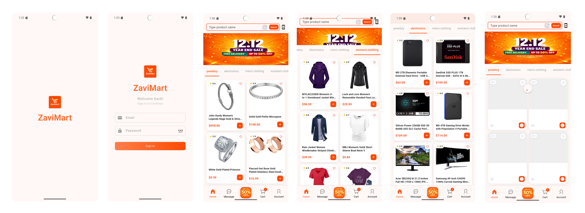

# ZaviMart

**Flutter version:** 3.38.5  
**App name:** ZaviMart  
**Description:** A Flutter e‑commerce user interface demonstrating sliver‑based, single‑scrolled product listing with tabbed navigation.

---

## Overview

This repository contains the implementation for `ZaviMart` UI & includes authentication flows. The UI contains: collapsible header, a sticky tab bar, and horizontally swipable product categories.

---

## Screenshot



---

## Single Vertical Scroll

**Single vertical scroll** achieved by `NestedScrollView`, which coordinates the outer scroll and each tab's `CustomScrollView` as a unified scroll experience — technically multiple scrollables but only one is active at a time.

---

## Key Design Points

- **Single vertical scroll** by `NestedScrollView`, inner `CustomScrollView` as one unified scroll.
- **Collapsible header** (`SliverAppBar`) containing a search bar and promotional banner.
- **Sticky tab bar** implemented by `SliverPersistentHeader`.
- **Horizontal navigation** allowing both tapping and swiping.
- **Pull‑to‑refresh** enabled on each tab with `RefreshIndicator`.
- **API client** configured to use `https://fakestoreapi.com`.

---

## Mandatory Explanation

### 1. How Horizontal Swipe Was Implemented

`TabBarView` with `PageScrollPhysics` handles horizontal swipe between tabs.

```dart
TabBarView(
  controller: _tabController,
  physics: const PageScrollPhysics(), // horizontal swipe
  children: [...],
)
```

- `PageScrollPhysics` ensures swipe cleanly between tabs
- It only listens **horizontal** gesture — vertical scroll is never touched
- Tapping a tab label switches tabs by shared `TabController`
- Both tap and swipe are intentional and predictable — no accidental vertical interference

---

### 2. Who Owns the Vertical Scroll and Why

**`NestedScrollView` owns the vertical scroll.**

```
NestedScrollView (outer scroll owner)
  ├── SliverAppBar              → collapses on scroll
  ├── SliverPersistentHeader    → sticks when header collapses (TabBar)
  └── TabBarView body
        └── Each tab: CustomScrollView (inner scroll)
```

- `NestedScrollView` coordinates the outer scroll (header collapse) and inner scroll (tab content) as a **single unified vertical scroll experience**
- The user never feels two separate scrolls — `NestedScrollView` hands off scroll between outer and inner automatically

---

### 3. Trade-offs and Limitations

**What works well:**
- Header collapses cleanly
- TabBar sticks correctly below status bar
- Pull-to-refresh works on every tab
- No scroll jitter or conflict
- Horizontal swipe does not affect vertical scroll

**Known limitation:**

Distinct per-tab scroll position with ONE vertical scrollable is a known Flutter conflict fundamentally.

- To keep distinct per-tab scroll positions → each tab needs its own `ScrollController` → technically multiple scrollables exist, as these two requirements are **mutually exclusive** in Flutter's scroll system, these could be considered a framework limitation.

---

> **Note:** Suggesting any better approaches appreciable or any single vertical scroll handler, eager to know about that.

## Running the Project

**Flutter version:** 3.38.5

1. Launch with `flutter run` on a device or emulator.
